# 设计模式的简单整理

> Gof 的23种设计模式，个人理解偏多。
>
> - 2022/06/15 更新七大法则描述
> - 2022/06/16 更新全部创建型模式描述
> - 2022/06/18 更新代理模式和装饰器模式描述
> - 迭代器模式、访问者模式、备忘录模式、解释器模式暂时忽略

---


## 设计模式的七大法则

> 说是法则，但是有些不必完全遵守。


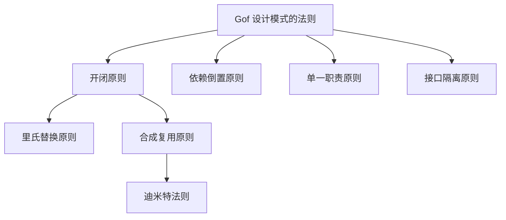
```mermaid
graph TD
	A[Gof 设计模式的法则] --> 开闭原则
	开闭原则 --> 里氏替换原则
	开闭原则 --> 合成复用原则
	合成复用原则 --> 迪米特法则
	A --> 依赖倒置原则
	A --> 单一职责原则
	A --> 接口隔离原则
```

以上**我理解中的**七大法则之间的关系。

设计模式的最终目的：**低耦合性，易于扩展，高复用且高稳定性。**

<br>

### **开闭原则**

开闭原则是最基本的原则之一，可以简单理解为**对扩展开放，对修改关闭。**

对功能的增删或者修改都应该通过扩展来实现，而不应该直接修改源代码，**扩展的形式包括组合或者继承**，例如代理模式，装饰器模式或者模板模式都很好的符合了开闭原则。

> 从整体设计上来说，类似 Sentinel 或者 Spring 都提供了很好的扩展形式，类似 BeanPostProcession 或者 SpiLoader。

个人以为，大部分情况下，开闭原则都应该被遵守。

<br>

### **里氏替换原则**

**替换就是指在所有使用父类的地方，可以用子类代替，因此也要求子类不该修改父类的逻辑。**

我理解中是对开闭原则的进一步补充，规范继承的形式准则。

如果实际情况违背了里氏替换原则，则表明抽象不合理，父类并不能代表全部的子类特性。

<br>

### **合成复用原则**

**该原则规定，除非共性固定且突出，否则都应该要尽量使用聚合等关联关系来代替继承关系来实现类之间的关联。**

继承就表示子类和父类之间的高耦合度，父类的任何改动都会影响到子类，会对子类会产生一些约束和限制，不利于扩展。

同理，也可以理解为对开闭原则中组合的规范。

> 如果是高度同质性的，继承还是合理的，并不是完全否定继承的作用。

<br>

### **迪米特法则**

**该法则规定如果两个类没有直接关系，那么就不应该产生直接的相互调用，可以通过第三方转发该调用。**

**该法则提高了类之间的独立性，降低了耦合度，是对合成复用原则的约束和补充。**

**SpringBoot 中对 BeanFactoryPostProcessor 的调用可能就是这个法则，**使用 Delegate 类间接调用，而且使用的静态方法也不会额外引入依赖。

<br>

### **依赖倒置原则**

**类之间的依赖需要按照一定的规则顺序，高层抽象类不能依赖底层的具体实现。**

**违背依赖倒置原则会大大增加类间的耦合性不利于代码维护。**

<br>

### **单一职责原则**

**简单理解就是希望类的功能尽量单一，一个类不应该承载太多的职责。**

**降低类的复杂度，减小类的实现粒度，都有利于减小类之间的耦合性，方便重用和后期维护。**

不仅仅是针对类，针对类中的方法应该也需要向改原则靠拢，简单清晰的方法更容易维护和重用。

<br>

### **接口隔离原则**

**和单一职责原则很相似，在我理解可能就是规定的对象不同，接口隔离就是特指接口。**

**简单理解该原则，可能就是规定接口的粒度需要尽量的小。**

**比如 Java 中的 Closeable 之类的接口，或者 Spring 中的各类顶级接口。**

<br>


<br>

## 设计模式的分类

根据目的来分设计模式可以分为创建型，结构型和行为型。

**创建型模式主要着力于对象的创建过程，将创建和使用过程分离。**

**结构型模式主要着力于对象的继承和实现，如何通过一些基本接口和对象组装成一个更大的结构。**

**行为型模式主要描述类之间的调用关系，规范化方法和方法的职责，用于描述类或对象之间协作的过程。**

> 个人理解，创建型的模式属于行为模式的一种，因为规范的就是创建的行为。
>
> 

<br>

---

## 创建型模式

创建型模式主要关注对象的创建过程。


### 单例模式（Singleton）

单例模式的定义如下:

> **Ensure a class has only one instance, and provide a global point of access to it.**

类图如下:

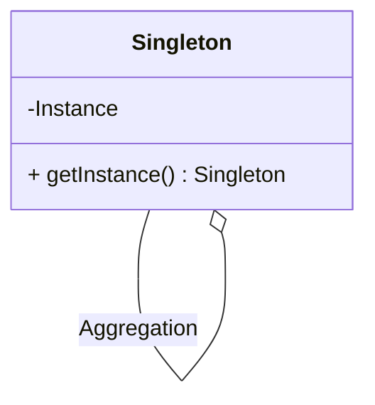
```mermaid
classDiagram

	Singleton --o Singleton : Aggregation
	Singleton: -Instance
	Singleton: + getInstance() Singleton
```

<br>

**单例模式必须保证类的实例对象在系统中的唯一性，并提供一个全局的访问点，**

类似一些重量级对象都可以使用单例模式实现，保证全局的访问安全，也减少内存的浪费。

**单例模式主要有以下几个核心：**

1. **构造函数私有化，阻止类外部的初始化**
2. **类内部持有自身唯一实例的引用**
3. **提供一个对外的获取接口**

单例模式的持有和创建都在类内部，基本的单例模式如下，首先是**饿汉模式**：

```java
public class HungrySingle{
    	// 内部持有实例引用
    	private static final HungrySingle INSTANCE = new HungrySingle();
    	
    	// 私有化构造函数
    	private HungrySingle(){
            	// 私有化之后，JVM也不会自动生成一个public的无参构造
        }
    
    	// 提供统一的话获取方法
    	public static HungrySingle getInstance(){
            	return INSTANCE;
        }
}
```

**饿汉模式的特点就是在类加载时候就会实例化对象，通过 JVM 的类加载机制保证实例的唯一性。**

而另外一种**懒汉模式**，则是在此基础上增加了**懒加载**的特性，只有在需要的时候才会初始化。

> 个人更倾向于饿汉模式，早晚都要创建，何必呢。

```java
public class LazySingle{
    	private static final LazySingle INSTANCE;
    
    	private LazySingle(){}
    
    	public static LazySingle getInstance(){
            	if(INSTANCE == null){
                    	INSTANCE = new LazySingle();
                } 
            	return INSTANCE;
        }
}
```

但以上代码并非是线程安全的，多线程环境下可能仍然会创建多个实例对象。

<br>

为了保证懒汉模式的线程安全性，确保实例对象的唯一性，所以又有了**静态内部类，枚举以及双重检查锁模式**。

以下是**双重检查锁**的 `getInstance` 方法：

```java
public class LazySingle{
    	// INSTANCE 实例必须使用 volatile 标识
    	private volatile static final LazySingle INSTANCE;
    
    	private LazySingle(){}

        public static LazySingle getInstance(){
          	// 首次检查确保对象并为被创建
            if(INSTANCE == null){
              			// 保证创建过程的线程安全
                    synchronized(LazySingle.class){
                      			// 在 sync 之后重新判断静态条件
                      			// 在获取到 LazySingle 的锁之后，INSTANCE 可能已经被创建了。
                            if(INSTANCE == null){
                                	INSTANCE = new LazySingle();
                            }
                    }
            }

            return INSTANCE;
        }
}
```

**使用了 synchronized 来保证创建过程的线程安全。**

**volatile 保证的其实是 INSTANCE 的赋值过程不会被重排序，因为第一次判断并不在  synchronized 里面，所以并不具有可见性就可能出现如下情况：**

```java
// 线程1					线程2
// 分配空间 
// 赋值引用				  
// 初始化			       判断是否为空，不为空则直接使用

线程1的创建过程在重排序之后变成以上的情况，原本应该是先初始化再赋值引用，但真实执行顺序颠倒。
导致线程2在获取到引用地址时，可能并没有初始化完毕，所有可能会出现 NPE 的报错。
```

<br>

<br>

**静态内部类**的实现方式如下：

```java
public class LazySingle{
    
    	private LazySingle(){}
    
    	// 由静态内部类持有单例对象的引用。
    	private static class InstanceHolder{
            	private static final LazySingle INSTANCE = new LazySingle();
        }
    	
    	public static getLazySingle(){
            	return InstanceHolder.INSTANCE;
        }
}
```

**唯一实例是由静态内部类持有的。**

在加载外部类 LazySingle 的时候并不会直接加载内部类 InstanceHolder，只有在使用到内部类的相关属性的时候才会去进一步加载，也就是在调用 getLazySingle 时才会初始化。

<br>

另外就是 effective java 作者也强烈推荐的**枚举类实现**方式：

```java
public class LazySingle{
    	private LazySingle(){}
    
    	private enum  InstanceHolder{
            	INSTANCE;
            	
            	private final LazySingle single;
            
            	InstanceHolder(){
                    	single = new LazySingle();
                }
            
            	private LazySingle getSingle(){
                    	return single;
                }
        }
    	
    	public static getLazySingle(){
            	return InstanceHolder.INSTANCE.getSingle();
        }
}
```

该种实现方式充分利用了枚举类型的特性，保证了加载的线程安全性和实例对象的唯一性。

而且是所有单利模式中唯一一种免疫序列化，反射破坏形式的实现。

<br>

再来说说反射对单例模式的破坏。

单例模式为了防止对象的再次创建，会将构造函数设置为私有的，但是反射是可以绕过这种权限控制的。

```java
public class Solution {
    static class Single {
        static int cnt = 0;

        private Single() {
            cnt++;
        }

        public void single() {
            System.out.println(cnt);
        }
    }
    public static void main(String[] args) throws NoSuchMethodException, InvocationTargetException, InstantiationException, IllegalAccessException {
        final Class<Single> singleClass = Single.class;
        // 获取构造函数
        final Constructor<Single> declaredConstructor = singleClass.getDeclaredConstructor();
        // 修改访问权限
        declaredConstructor.setAccessible(true);
        for (int i = 0; i < 10; i++) {
            final Single single = declaredConstructor.newInstance();
            single.single();
        }
    }
}
```

> 反射在提供了更大的便利的同时，好像也出现了一些安全问题啊。

<br>

单例模式的使用实例：

- Spring Bean（存在一定争议，Spring 中单例的实现以 Bean 名称为单元而非真实对象。

<br>

单例模式分为饿汉模式和懒汉模式，懒汉模式实现有双重检查锁，枚举类，静态内部类等。

最后来总结一下单例模式的优点：

1. **单例模式保证了一个类仅有唯一的实例，并提供一个全局访问点，保证全局的访问便利。**
2. **有效的节省资源**


<br>

<br>

### 原型模式（Prototype）

原型模式的定义如下:

> **Specify the kinds of objects to create using a prototypical instance, and create new objects  by copying this prototype.**

类图如下:

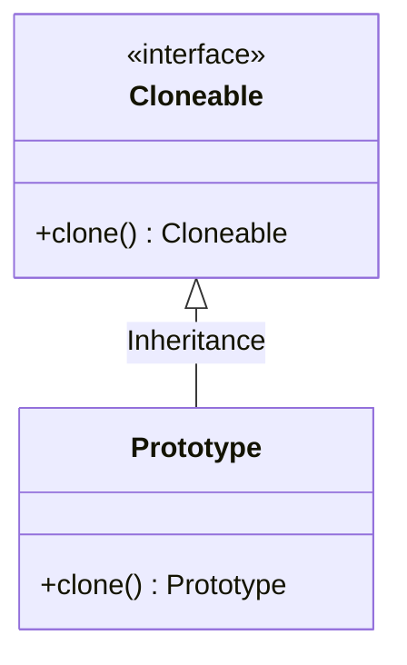
```mermaid
classDiagram
class Cloneable
<<interface>> Cloneable
Cloneable: +clone() Cloneable

class Prototype
Prototype: +clone() Prototype

 Cloneable  <|-- Prototype : Inheritance 
```

<br>

这个可能是设计模式中简单程度仅次于单例模式的一种了，甚至于 Java 中它比单例更简单。

原型模式用来创建重复的对象，不同于一般的 new，原型模式的对象创建用克隆来完成，对于 Java 来说就是 Cloneable 接口，clone 方法会带上原类型的所有属性，所有也免去了属性配置的问题。

<br>

**Java 中的 Object 类就提供了 clone 方法，所以 Java 中每个类都可以使用原型模式。**

而且要注意的是 **Java 中的 clone 方法，会跳过构造函数的执行**，**所以使用克隆方法的优势就是性能好**，起码优于逐个 new 对象。

在任何创建大量重复对象的场景下，都可以尝试用原型模式替换。

```java
public class Prototype implements Cloneable{
		// 原型类只需要提供一个克隆的方法
        @Override
        protected Object clone() throws CloneNotSupportedException {
            return super.clone();
        }
}

```

<br>

原型模式需要注意的点有：

1. 克隆会直接跳过构造函数
2. 克隆还需要注意深浅的区别

<br>

**Spring 中 IOC 容器提供的两种基础的创建模式就是单例和原型。**

<br>

<br>

### 简单工厂模式(Simple Factory)

工厂模式的思路很简单，**就是完全将创建过程剥离，对象的创建交由工厂类完成，使用者并不需要知道如何创建的的对象。**

> 这里的**工厂**这个概念，就非常适合使用**单例模式**实现。

<br>

！！简单工厂模式并不属于 GoF 设计模式。

**简单工厂模式就是将一个或者多个对象的创建交由单个工厂类完成，工厂对外提供一个创建方法，包含对象的完整创建逻辑。**

很多情况下可以再创建方法中使用 case 判断区分创建不同种类的产品。

类图如下：

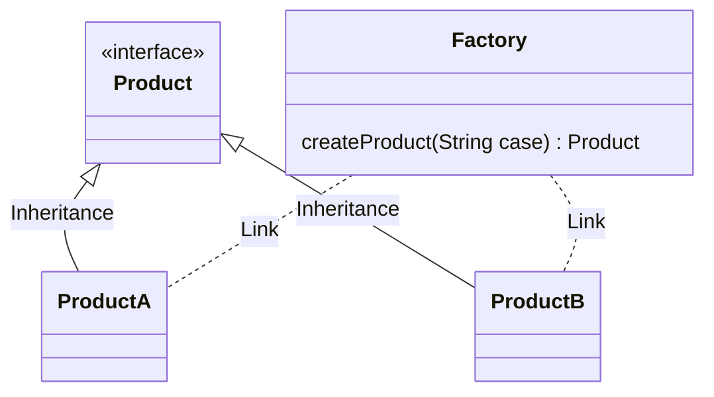
```mermaid
classDiagram
class Product
<<interface>> Product
class ProductA
Product <|-- ProductA :Inheritance
class ProductB
Product <|-- ProductB :Inheritance
class Factory
Factory: createProduct(String case) Product 
Factory .. ProductA : Link
Factory .. ProductB : Link
```

Java 中简单工厂模式简单来说可以有如下的实现：

```java
// 工厂类
public class SimpleFactory {
    public Product createProduct(String productName){
        if(productName.equals("A")){
            return new ProductA();
        }
        if(productName.equals("B")){
            return new ProductB();
        }
        return null;
    }
}

// 产品类接口
interface Product{
    String getName();
}

// 产品A
class ProductA implements Product{
    @Override
    public String getName() {
        return "A";
    }
}

// 产品B
class ProductB implements Product{
    @Override
    public String getName() {
        return "B";
    }
}

```

可以看到这种实现虽然也剥离了创建对象的逻辑，但是它**严重违反了开闭原则**，如果引入一个新产品，就需要新增一个创建方法，或者修改原有的创建方法，除此之外几乎就别无他法。

而且**一定程度上的违反了单一职责原则**，一个工厂负责所有类的创建，太过繁杂。

<br>

实现的实例：

- Spring 的 BeanFactory

简单工厂模式中产品的创建过程和工厂耦合过于严重，任何对创建过程或者产品的修改都需要直接修改原逻辑，严重违反了开闭原则。

但是在 Spring 中，对象的创建被进一步的拆分为，实例化，属性填充，初始化等步骤，并且都设了合理的钩子函数，以及使用一定形式 XML 或者注解的形式去声明一个对象的属性等，进一步优化的简单工厂模式带来的难以扩展的缺点。

并且利用工厂管理的依赖的形式，几乎完美的解耦了类之间的依赖关系，可以更好的关注于业务。

<br>

<br>

### 工厂方法模式(Factory Method)

工厂方法模式的定义如下:

> **Define an interface for creating an object, but let subclasses decide which class to instantiate. Factory Method lets a class defer instantiation to subclasses.**

咳咳咳。。所以基于扩展性考虑引申出了工厂方法模式，工厂方法模式可以算是简单工厂模式的进一步抽象。

**工厂方法模式抽象对象创建的方法，而将具体的对象延迟到子类决定。**

类图如下:

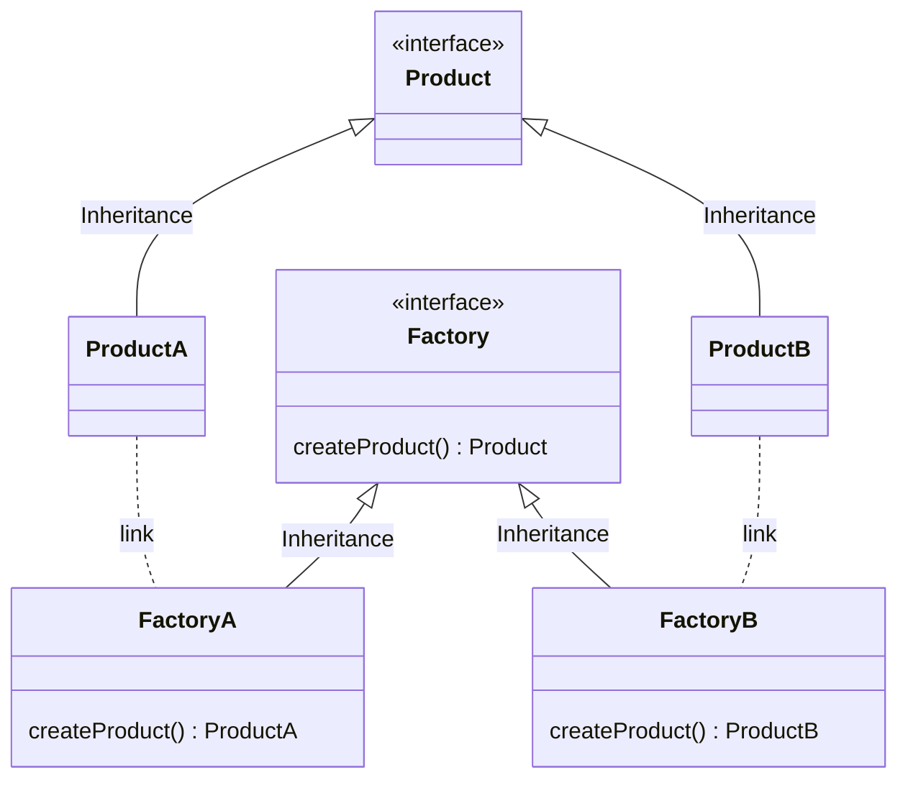
```mermaid
classDiagram
class Product
<<interface>> Product
class  Factory
<<interface>> Factory
Factory: createProduct() Product
class FactoryA
Factory <|-- FactoryA :Inheritance
FactoryA: createProduct() ProductA
ProductB .. FactoryB :link
ProductA .. FactoryA: link
class FactoryB
Factory <|--FactoryB :Inheritance
FactoryB: createProduct() ProductB
class ProductA
Product <|-- ProductA :Inheritance
class ProductB
Product <|--ProductB :Inheritance
```

**将工厂的创建方法抽象到工厂接口中，具体的创建逻辑延迟到具体的子类中。**

往往一个产品会对应一个工厂子类，以增加实现类的形式完成对不同产品的需求扩展。

以 java 的 Reader 为例，就可以使用以下的方法：

```java
interface FactoryMethodInterface {
    	Reader create(File file) throws FileNotFoundException;
}

class BufferReaderFactory implements FactoryMethodInterface {
        @Override
        public BufferedReader create(File file) throws FileNotFoundException {
                final FileInputStream in = new FileInputStream(file);
                final InputStreamReader in1 = new InputStreamReader(in);
                return new BufferedReader(in1);
        }
}

class FileReaderFactory implements FactoryMethodInterface {
        @Override
        public Reader create(File file) throws FileNotFoundException {
            	return new FileReader(file);
        }
}
```

<br>

相比于简单工厂模式来说，**工厂方法模式不再局限于单一的工厂类**，更有利于代码解耦和扩展。

但如果在使用工厂方法模式的时候，抽象接口也只有单一继承，那么也就和简单工厂模式没啥区别了。

总得来说工厂方法模式中，**一个工厂类仍局限于单个的产品类，并且增加产品类就需要创建新的工厂实现类的设定，很大程度上增加了编码的复杂性。**

<br>

具体的使用实例：

- Spring 中的 FactoryBean 类

FactoryBean 接口中定义了 getObject 方法，是最简单的工厂方法模式的实现，使用 FactoryBean ，用户可以绕开 Spring 的 Bean 创建体系，个性化创建一系列对象。

<br>

<br>

### 抽象工厂模式(Abstract Factory)

抽象工厂模式如下：

> **Provide an interface for creating families if related or dependent objects without specifying their concrete classes.**

如果说从简单工厂模式到工厂方法模式是提取了公用的方法接口，进一步抽象了工厂类。

**那么抽象工厂接口就是进一步抽象了产品类，产品也不仅仅局限于一种，对应的产品类的扩展，工厂创建类的创建方法数也增加了，并且定义中也说明了是一类有关系的对象。**

类图如下：

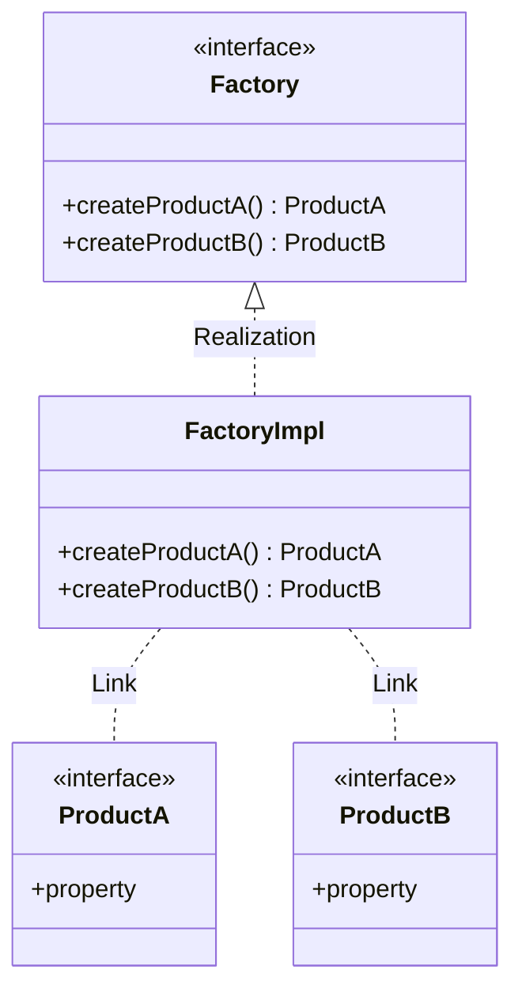
```mermaid
classDiagram
class Factory
<<interface>> Factory
Factory: +createProductA() ProductA
Factory: +createProductB() ProductB

class ProductA
<<interface>> ProductA
ProductA: +property

class ProductB
<<interface>> ProductB
ProductB: +property

class FactoryImpl
FactoryImpl: +createProductA() ProductA
FactoryImpl: +createProductB() ProductB

Factory <|.. FactoryImpl :Realization
FactoryImpl .. ProductA :Link
FactoryImpl .. ProductB :Link

```

继续拿 Reader 举例，此时如果需要添加一个 Writer 类，假设不同的 Reader 和 Writer 是一种对应关系，此时就的工厂方法模式可能就有点顶不住了。

根据抽象方法模式实现之后如下：

```java
class BufferReaderFactory implements AbstractFactoryInterface {
    @Override
    public BufferedReader createReader(File file) throws FileNotFoundException {
        final FileInputStream in = new FileInputStream(file);
        final InputStreamReader in1 = new InputStreamReader(in);
        return new BufferedReader(in1);
    }

    @Override
    public Writer createWriter(File file) throws FileNotFoundException {
        final FileOutputStream out = new FileOutputStream(file);
        final OutputStreamWriter outputStreamWriter = new OutputStreamWriter(out);
        return new BufferedWriter(outputStreamWriter);
    }
}

class FileReaderFactory implements AbstractFactoryInterface {
    @Override
    public Reader createReader(File file) throws FileNotFoundException {
        return new FileReader(file);
    }

    @Override
    public Writer createWriter(File file) throws IOException {
        return new FileWriter(file);
    }
}
//  抽象工厂接口
interface AbstractFactoryInterface {
    Reader createReader(File file) throws FileNotFoundException;

    Writer createWriter(File file) throws IOException;
}
```

<br>

抽象工厂模式的接口中存在不止一种产品的创建方法，并没有硬性要求。

<br>

### 工厂模式总结

理论上说简单工厂模式已经拥有了工厂模式的核心，**以工厂的概念抽离出对象创建的逻辑，实现对象创建和使用的解耦。**

但是简单工厂模式有以下几个缺点：

1. 不符合开闭原则，难以扩展。
2. 单工厂的逻辑过重，承载了太多的创建逻辑。

单工厂的逻辑过重的问题会随着需要负责的类的增多而凸显，增加维护难度，很大程度上违背了单一职责，接口隔离原则。

针对以上问题，就有了工厂方法模式，**工厂方法模式在简单工厂模式的基础上，抽象出创建方法，利用不同的子类实现来分散单工厂的逻辑，方便维护。**

工厂方法模式可以说已经不错了，抽象程度也基本足够，但是在一个工厂类一个创建方法的形式下，**很难描述具有关联关系的不同的产品类。**

**所以在工厂方法模式的基础上，抽象工厂模式中抽象出了不同的创建方法，应对多个关联产品的创建。**

个人感觉，**这个关联关系很重要**，如果用一个抽象工厂模式实现两个完全不搭边的产品的创建，那就又回到了简单工厂模式，以新增方法的形式去兼容新产品的加入。

类似于 Reader 和 Writer 的实现，FileReader 同一个工厂创建的应该就是 FileWriter。

<br>

<br>

<br>

### 建造者模式(Builder)

建造者模式的定义如下：

> **Separate the construction of a complex object from its representation so that the same construction process can create different representations.**

建造者模式也是一种创建型模式，不同于工厂模式完全分离对象创建和使用的逻辑。

**建造者模式拆分了对象的创建过程，对创建的流程进行抽象，使创建过程可以分步骤或者分模块进行，使对象创建的范围更加可控，相同的创建流程也可以创建出不同对象。**

类图如下：

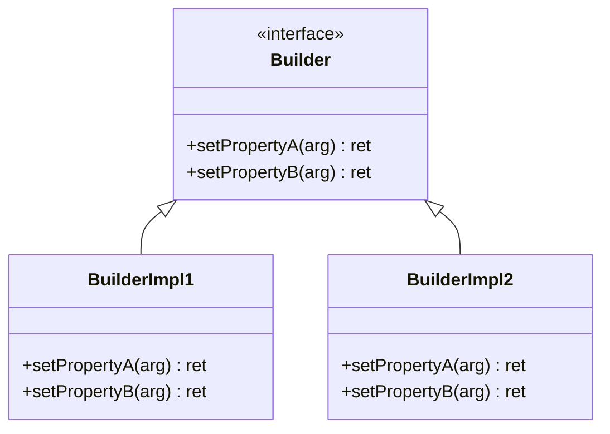
```mermaid
classDiagram
class Builder
<<interface>> Builder
Builder: +setPropertyA(arg) ret
Builder: +setPropertyB(arg) ret

class BuilderImpl1
BuilderImpl1: +setPropertyA(arg) ret
BuilderImpl1: +setPropertyB(arg) ret

class BuilderImpl2
BuilderImpl2: +setPropertyA(arg) ret
BuilderImpl2: +setPropertyB(arg) ret

Builder <|-- BuilderImpl1
Builder <|-- BuilderImpl2

```


我们可以用电脑组装的过程为例子来理解：

```java
class Director{
    private Builder interBuilder = new InterBuilder();
    private Builder amdBuilder = new AMDBuilder();

    public Computer builder(){
        final Computer computer = new Computer();
        computer.cpu = interBuilder.cpu();
        computer.memory = amdBuilder.memory();
        return computer;
    }

}

class Computer{
    private String cpu;
    private String memory;
}

interface Builder{
    String cpu();
    String memory();
}

class InterBuilder implements Builder{
    @Override
    public String cpu() {
        return "Inter CPU";
    }
    @Override
    public String memory() {
        return "Inter Memory";
    }
}

class AMDBuilder implements Builder{
    @Over建造者模式关注的是对象的创建过程或者说步骤。ride
        public String cpu() {
        return "AMD CPU";
    }
    @Override
    public String memory() {
        return "AMD Memory";
    }
}

```

建造者模式中存在四种对象：

1. Product  产品：指代最终要生成的对象，例子中的Computer
2. Builder  建造者接口/基类： 抽象出创建的流程或者组成部分，供子类实现。
3. Concrete Builder 实际建造者： 实现建造者接口/基类，完成具体的建造逻辑
4. Director 组装类 : 封装一个具体的组装逻辑，负责调度不同的建造者生成对应的产品

<br>

使用实例：

- Lombok @Builder 注解

Lombok 中就有一个 @Builder 的注解，该注解以 Setter 方法返回当前实例的形式来实现建造者模式，可以分别对单个成员变量进行配置。

<br>

### 工厂模式和建造者模式的比较

首先两个模式的目的和作用就不一样。

工厂模式**的目的调用和创建两个操作之间的解耦**，对调用者来说屏蔽了创建的过程，工厂类也不关心具体的创建。

但建造者模式却不同，**它关注的是对象的创建过程，通过拆分可一个完整的创建过程的方式让创建过程更加清晰。**

按照步骤或者成分的拆分，会使创建过程更加有条理，易于把握对象的整个创建过程。

所以很大程度上工厂模式和建造者模式可以互补。


## 创建型模式总结

首先明确一点，上文也说过，创建型模式的重点都在创建中，该类型模式不关注调用或者继承关系，他关注的就是对象的创建。

**单例模式旨在过各种手段保证对象的创建过程只执行一次，顺带保证了对象的唯一性。**

**原型模式则是通过拷贝的方式，加速对象的创建过程(拷贝会跳过构造函数的执行)，或者因为都是相同的源对象而具有相同的属性。**

工厂模式则是更加纯粹的创建型模式，它的关注点在于对创建这个过程的解耦，调用者不需要关心创建的逻辑，例如你买车总不会需要知道整辆车的原理吧。

**简单工厂模式就可以完成对该过程的解耦，将创建的逻辑集中在一个工厂类，并提供一个对外的生产方法，调用者直接调用该方法获得自己想要的对象。**

**工厂方法模式是对工厂类的进一步抽象，提取出公共方法后分子类实现各产品族自己的逻辑，避免单工厂类单来的强依赖**，这里并不是说简单工厂模式就没有上层接口，工厂方法模式在只有一个工厂类的时候，也就是简单工厂模式。

抽象工厂模式则是对产品族的扩展，对于两个无任何关系的产品，简单工厂和工厂方法模式都可以支持，简单工厂模式可以增加一个创建方法或者在唯一创建方法中增加该类创建判断，工厂方法模式可以创建对应的实现子类。

但是对于有关联性的产品，上述两个模式处理起来其实和无关联的产品没啥区别。

**抽象工厂模式在上层接口中就定义了产品族中不同产品的创建方法，以此来确定关联性。**

关于抽象工厂方法，可能是我个人理解偏多，因为对产品族和工厂类的扩展工厂方法模式其实已经能满足大部分需求了。

建造者模式和工厂模式的区别就是它的关注点在创建的流程，工厂模式是将创建当做一个整体来看的，并不限制或者说不关心创建的流程。

**建造者模式则是对创建的流程进行抽象拆分，细化创建的步骤或者模块，更加适用于复杂对象的创建。**


> 单例模式关注对象创建的次数。
>
> (?) 原型模式关注对象创建时的属性迁移。
>
> 工厂方法模式抽象创建过程，减少调用方和对象的耦合关系。
>
> 抽象工厂模式进一步抽象需要创建的对象。
>
> 建造者模式与上述解耦创建过程的模式不同，极度的细化创建的流程，使对象创建更加清晰。


## 结构型模式

结构型模式主要关注类和类之间的关系，主要是有聚合和继承。

根据类之间的关系可以分为：

1. 类结构型模型 - 继承
2. 对象结构型模型 - 聚合

**继承一般意义上都具有强关联型，或者说强侵入性，子类必须继承父类的一系列特性，那么父类的修改必定会影响到子类，子类也会有所束缚。**

相比之下，聚合就显得更加了灵活。


### 代理模式(Proxy)

代理模式的定义如下：

>**Provider a surrogate or placeholder for another object to control access to it.**

定义中所说的，代理模式的核心在于通过一个 surrogate 或者 placeholder 来完成对另外一个对象的访问控制，所谓的访问控制可以简单看作是在执行前后的添加的钩子方法。

<br>

类图如下：

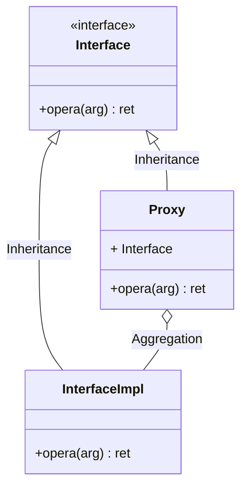
```mermaid
classDiagram

class Interface
<<interface>> Interface
Interface: +opera(arg) ret

class InterfaceImpl
InterfaceImpl: +opera(arg) ret

class Proxy
Proxy: + Interface
Proxy: +opera(arg) ret

Interface <|-- Proxy : Inheritance
Interface <|-- InterfaceImpl : Inheritance
Proxy o-- InterfaceImpl : Aggregation

```

<br>

代理模式的核心内容是**通过中间的代理对象间接调用真实业务对象**。

代理类需要和真实对象继承相同的接口，也需要持有真实对象的引用，**因为最终还是会调用到真实对象。**

对于客户端来调用的方法没变，但是中间多了一层代理，因为中间透过代理对象的关系，所以可以在代理对象中添加一系列额外逻辑。

<br>

Java 中的简单实现如下:

```java
interface FinancialManagement {
    void investmentFund(float money);
}

class RealFinancialManagement implements FinancialManagement {
    @Override
    public void investmentFund(float money) {
        System.out.println("亏不死你!");
    }
}

class Proxy implements FinancialManagement {

    RealFinancialManagement realFinancialManagement = new RealFinancialManagement();

    @Override
    public void investmentFund(float money) {
        realFinancialManagement.investmentFund(money);
    }
}
```

**重点就在透过代理去调用方法，而不是直接调用真实方法。**

除了上面的静态代理，也就是手动编码实现一个代理方式之外，还有一种更加通用的动态代理模式。

<br>

JDK 中就提供了动态代理的 API，demo如下：

```java
interface Subject{
    void doSomething();
}

class RealSubject implements Subject{
    @Override
    public void doSomething() {
        System.out.println("// realSubject do something");
    }
}

class MyProxy implements InvocationHandler{
    Subject subject;
    public MyProxy(Subject subject) {
        this.subject = subject;
    }
    void before(){
        System.out.println("// ====== before");
    }
    void after(){
        System.out.println("// ====== after");
    }
    @Override
    public Object invoke(Object proxy, Method method, Object[] args) throws Throwable {
        before();
        method.invoke(subject,args);
        after();
        return null;
    }
}

public class Main {
    public static void main(String[] args) throws IllegalAccessException, InstantiationException, NoSuchMethodException, InvocationTargetException {
        // 获取代理类
        // JDK动态代理只能代理接口
        final Class<?> proxyClass = Proxy.getProxyClass(Subject.class.getClassLoader(), Subject.class);
        // 获取构造函数
        final Constructor<?> constructor = proxyClass.getConstructor(InvocationHandler.class);
        // 创建具体的代理对象
        final Subject subject = (Subject) constructor.newInstance(new MyProxy(new RealSubject()));
        subject.doSomething();
        // 另外一种创建形式
        //        final Subject subject1 = (Subject) Proxy.newProxyInstance(Subject.class.getClassLoader(), new Class[]{Subject.class}, new MyProxy(new RealSubject()));
    }
}

```

<br>

利用代理模式，可以在原代码不发生任何修改的情况下完成对类的增强。

在方法调用的前后，借用代理类的实现，可以添加日志或者鉴权等前置或者后置操作。

<br>

**使用实例：**

- Spring 的 AOP 实现

Spring 的 AOP 实现有两种代理的方式，JDK 的动态代理以及 CGLIB 的字节码修改逻辑。

<br>


### 装饰模式（Decorator）

**装饰器模式的定义如下：**

>  **Attach additional responsibilities to an object dynamically keeping the same interface. Decorators provide a flexible alternative  to subclassing for extending functionality.**

<br>

类图如下：

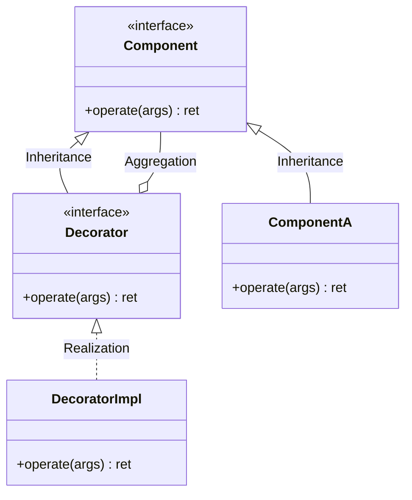
```mermaid
classDiagram

class Component
<<interface>> Component
Component: +operate(args) ret

class Decorator
<<interface>> Decorator
Decorator: +operate(args) ret

class ComponentA
ComponentA: +operate(args) ret

class DecoratorImpl
DecoratorImpl: +operate(args) ret

Component <|-- Decorator : Inheritance
Component <|-- ComponentA : Inheritance
Decorator o-- Component : Aggregation
Decorator <|.. DecoratorImpl : Realization

```

<br>

装饰模式的作用就是**在不改变原实现的情况下，动态的增强某一些功能。**

一般的情况下，扩展是用继承来实现的，但是这就有一个问题，随着扩展次数的增多，类会越来越臃肿，层次混乱。

所以装饰模式采用的是聚合的方法，持有待装饰对象的引用，并扩展其方法，因为仅仅是调用，所以也不会对原来功能造成影响。

简单来说也是具体的装饰器类持有原实现类的引用，通过在调用前后加功能模块的形式对原类作增强，这点其实和代理模式高度一致。

<br>

<br>

### 代理模式和装饰器模式的对比

首先，两者类图实现基本相同。

装饰器或者代理对象都需要持有原对象的引用，然后队员对象的业务逻辑进行一系列的修改。

**代理模式侧重的是真实业务逻辑的访问控制，而装饰器模式侧重的是对已有功能的的增强。**

装饰器模式就是代理模式的一种特殊情况。

<br>

<br>

### 门面模式(Facade)

门面模式的定义如下：

> **Provide a unified interface to a set of interface in a subsystem. Facade defines a higher-level interface that makes the subsystem easier to use.**

类图如下:

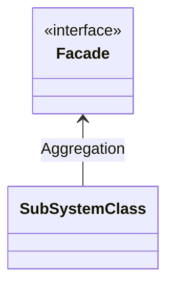
```mermaid
classDiagram

class Facade
<<interface>> Facade

class SubSystemClass

Facade <-- SubSystemClass : Aggregation
```

<br>

门面模式又可以称为外观模式，**旨在通过定义一个高层接口来简化对一个或多个复杂子系统的调用**。

门面模式的注意事项:

1. 门面模式下可以定义多个入口
2. **门面模式的实现类不参与任何的业务逻辑，仅仅是提供一个入口，就算没有门面模式子系统也可以完成相应的逻辑。**

<br>

类似的实例可以参考 Java 中 SLF4J 的实现，SLF4J 就是对于 Java 中众多的日志体系的一个门面服务，使用 SLF4J 作为统一的日志方法调用之后，可以所以更换底层的实现而不需要改变上层的调用。

<br>		<br>

### 适配器模式(Adapter)

适配器模式定义如下：

> **Convert the interface of a class into another interface clients expect. Adapter lets classes work together that couldn't otherwise because of incompatible interfaces.**

类图如下:

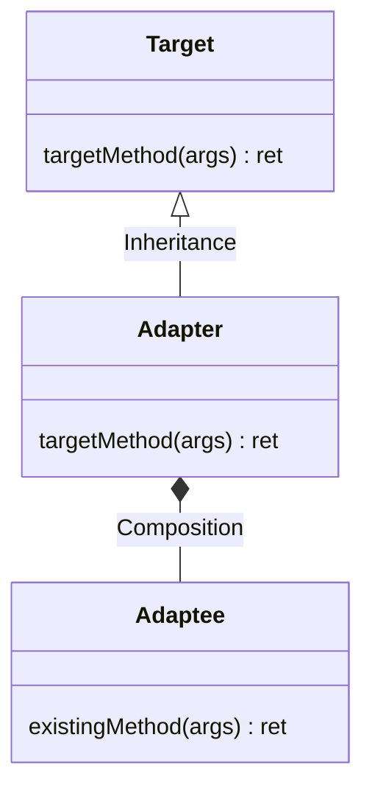
```mermaid
classDiagram

class Target
Target: targetMethod(args) ret

class Adaptee
Adaptee: existingMethod(args) ret

class Adapter
Adapter: targetMethod(args) ret 

Target <|-- Adapter :Inheritance
Adapter *-- Adaptee :Composition
```

<br>

**适配器模式主要用来作异构接口的适配，就是将一个已有的接口转化为调用者希望的另外一种接口。**

说到这个常常使用电压来比喻，比如国内电脑一般都是 220V 电压下运行，所以出国之后需要**一个适配器将电压调整到合适的大小**。

适配器模式的角色如下：

1. Target 目标角色，通过适配器希望得到的接口形式
2. Adaptee 当前角色，待适配的角色
3. Adapter 适配器，就是将Adaptee转化为Target的工具。

实现方式上一般使用，**适配器直接持有待适配角色的实例引用，并继承实现目标角色。**

<br>

简单的Demo如下：

```java
/**
     * 就是将乘2的方法变成乘4的过程
     */
interface Target {
    int multiply4(int i);
}
class Adaptee {
    int multiply2(int i) {
        return i * 2;
    }
}
class Adapter implements Target {
    Adaptee adaptee = new Adaptee();
    @Override
    public int multiply4(int i) {
        return adaptee.multiply2(i) * 2;
    }
}
```

Target 就是目标对象是系统希望的调用，但是目前仅有 Adaptee 适配对象，系统显然无法直接调用适配对象，方法名也不一样，实现也完全不一样。

所以 Adapter 适配器对象继承了目标对象，提供统一的方法签名方便调用，并持有适配对象的引用，对适配器对象的调用方法进行逻辑包装，使其符合想要的方法实现。

<br>

该模式作为是对已有类扩展的形式，**可以在不修改已有方法的基础上进行扩展并且满足新的需求**，是非常常见的设计模式。

但也有一个很突出的缺点，**就是这个适配器可能仅仅只能作用于一个待适配对象**，这样的话不同的待适配对象就需要不同的适配器，增加的类的数目和编码的复杂度，违反了开闭原则。

另外适配器模式也不能盲目的用，如果适配器的逻辑非常复杂，复杂到超过修改原有逻辑的程度，那就要考虑是不是代码设计就有问题了。

<br>

<br>

### 桥接模式(Bridge)

桥接模式的定义如下：

> **Decouple an abstraction from its implementation so that the two can vary independently.**

类图如下:

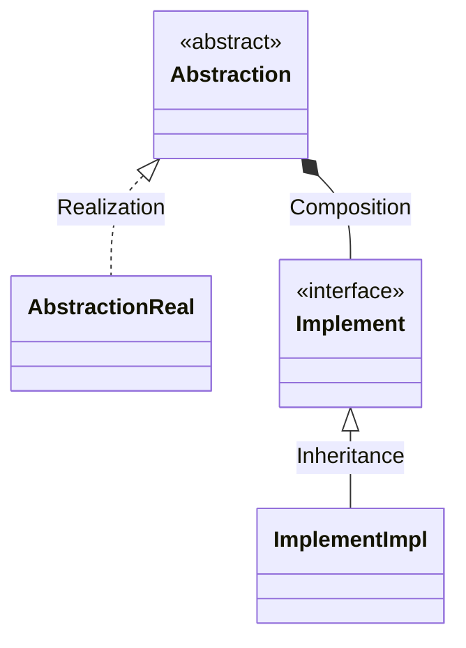
```mermaid
classDiagram

class Abstraction
<<abstract>> Abstraction

class AbstractionReal
Abstraction <|.. AbstractionReal:Realization


class Implement
<<interface>> Implement

class ImplementImpl
Abstraction *-- Implement :Composition
Implement <|-- ImplementImpl:Inheritance
```

<br>

桥接模式的核心思想就是：**将抽象部分与实现部分分离，使它们都可以独立地变化，而分离的方式就是使用组合，而非继承。分离之后的类就可以在多个维度上面保持良好的扩展性。**

桥接模式中的四类对象:

- Abstraction - 抽象化对象

该类一般定义为抽象类，并且保存对具体实现化对象的引用。

- Implementor - 实现化角色

该类一般是抽象化角色对象的某个属性或者是某方面逻辑，为了方便扩展，最好一个可变维度作为一个实现化角色。

- AbstractionReal - 抽象画实现角色

抽象化对象的具体实现，因此也继承了抽象化角色中堆 Implementor 的引用

- ImplementorImpl - 具体实现化角色

该类实现实现化角色的接口，对维度的变化作扩扩展。

<br>

通过以上的对象划分，在某方面属性发生变化时，可以在创建时或者就在执行中途更换 Implementor 的实现就可以修改抽象化对象的实现。

例如**电脑**对象，有 CPU 和 内存 等多维度的变化，如果使用继承关系来扩展，那扩展所需要的类是指数级增加的。

但如果将 CPU 和 内存 分别抽象为接口，并且以组合形式聚合到电脑类中，那么就可以有无数种不同的电脑，并且还不需要扩展太多的实现类。

<br>

简单示例如下：

```java
interface Memory{
    void store();
}
class SamsungMemory implements Memory{
    @Override
    public void store() {
        System.out.println("三星的内存");
    }
}
class ToshibaMemory implements Memory{
    @Override
    public void store() {
        System.out.println("东芝的内存");
    }
}
static abstract class Computer{
    Memory memory;
    public Computer(Memory memory) {
        this.memory = memory;
    }
    abstract void doSomething();
}
class MyComputer extends Computer {
    public MyComputer(Memory memory) {
        super(memory);
    }
    @Override
    public void doSomething() {
        super.memory.store();
    }
}
```

<br>

通过桥接模式可以很明显的看出组合的优势了，相对于继承来说组合的耦合性极低，只要定义好合适的接口，不行换实现类就好了，但如果是继承就可能是修改。


### 享元模式(Flyweight)

享元模式的定义如下:

> **Use sharing to support large numbers of fine-grained objects efficiently.**

类图如下：

```mermaid
kclassDiagram

class FlyweightFactory
FlyweightFactory: getFlyweight(key) Flyweight 

class Flyweight
<<Abstract>> Flyweight
Flyweight: intrinsic 
Flyweight: extrinsic

FlyweightFactory *-- Flyweight :Composition

class UnsharedFlyweight
class ConcreteFlyweight

Flyweight <|.. UnsharedFlyweight : Realization

Flyweight <|.. ConcreteFlyweight : Realization

```


**享元模式旨在通过共享对象的方式，来减少资源的消耗，支持大量的细粒度对象的获取。**

对于一个业务对象将其分为以下两部分状态：

- 内部状态，对象的内部状态，不会随着环境的变化和变化，也就是无关环境的状态，不需要额外配置。

类比连接池，内部状态就是连接自身的状态。

- 外部状态，就是指的随着环境的变化而变化，不可共享的状态。

类比连接池，外部状态可能就是具体的连接服务器的 ip 和 端口。

两种状态都是可有可无的，并不一定说非要有外部状态。

其中的对象角色分别是：

1. Flyweight，共享的对象，可以使用抽象类实现，指明内部以及外部状态
2. ConcreteFlyweight，继承 Flyweight，赋值外部状态
3. UnsharedFlyweight，继承 Flyweight，不可共享的实现
4. FlyweightFactory，代表该类的工厂，提供一个公共统一的获取入口

享元模式最典型的实现就是各类的池化技术，Java 中的 Long，Integer 等也使用了享元模式。

例如Integer类，在使用 Integer.valueOf 方法时，-128~127 便是 SharedFlyweight 对象，其他都属于 UnSharedFlyweight

<br>

<br>


### 组合模式(Composite)

组合模式的定义如下：

> **Compose objects into tree structures to represent part-whole hierarchies. Composite lets clients treat individual objects and compositions of objects uniformly.**

类图如下:

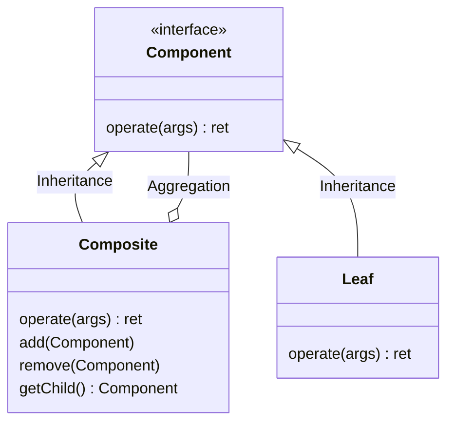
```mermaid
classDiagram

class Component
<<interface>> Component
Component: operate(args) ret

class Leaf
Leaf: operate(args) ret

class Composite
Composite: operate(args) ret
Composite: add(Component)
Composite: remove(Component)
Composite: getChild() Component

Component <|-- Composite : Inheritance
Component <|-- Leaf : Inheritance
Composite o-- Component : Aggregation
```

<br>

组合模式用来描述一种**部分-整体关系**的模式，**使单个对象和整体都具有一致的访问性。**

<br>

使用实例:

- Netty 的 EventLoopGrup

> EventLoop 直接继承 EventLoop 接口，是两者的访问方式达成一致。

 

## 结构型模式总结

上文有说到，结构型模式关注的是类和类之间的结构关系，其实更准确来说是被调用者或者说服务提供者的实现结构。

代理模式是通过代理类对外提供访问入口，在隐藏真实实现的同时，也可以在代理类中完成扩展。

适配器模式是通过适配器类对真实的被调用接口做一层适配，一般情况下都是调用方式的转变，所以一定程度上可以看做是特殊的代理模式。

桥接模式则是提供了一种多继承形式的代替方式，使用聚合进行代替，在多维度的属性中，采用多继承的形式势必会导致子类的暴增，使用桥接模式则可以将原来的乘法变为加法，大大增强类的扩展性。

**装饰模式则是侧重在不改变当前实现的基础上，完成了对原始类的增强。**

外观模式则是通过**提供一个统一的对外调用方法的形式**，调用者在调用时也就不需要直到各个子系统的调用逻辑。

到了享元模式，则完全是内部的实现逻辑了，**对一个对象的细粒度拆分，进一步对其内部状态进行整理，使部分对象可共享**，JDK的Integer类我觉得是这个模式的完美实现也容易理解，但作用最大的应该还是各种池化技术。

组合模式其实我是刚看，也没啥理解，**个人感觉是对一类具有层次结构的对象的组合形式，继承实现统一接口，对外展示为相同的调用形式。**


> 适配器模式


## 行为型模式

行为型模式关注的就不是类之间的结构关系了，**它关注的是类和类之间的调用关系，多个类如何协调完成一个功能。**

行为型模式分为**类行为模式**和**对象行为模式**，前者采用继承机制来在类间分派行为，后者采用组合或聚合在对象间分配行为。

由于组合关系或聚合关系比继承关系耦合度低，满足“合成复用原则”，所以相对来说，对象行为模式比类行为模式具有更大的灵活性。

<br>

### 模板方法模式(Template Method)

模板方法模式定义如下：

> **Define the skeleton of an algorithm in any operation, deferring some steps of an algorithm without changing the algorithm's structure.**

**模板方法模式旨在抽取出一个统一的算法骨架模板作为超类，而将一些特定的操作延迟到子类中实现。**

该模式的类图如下：

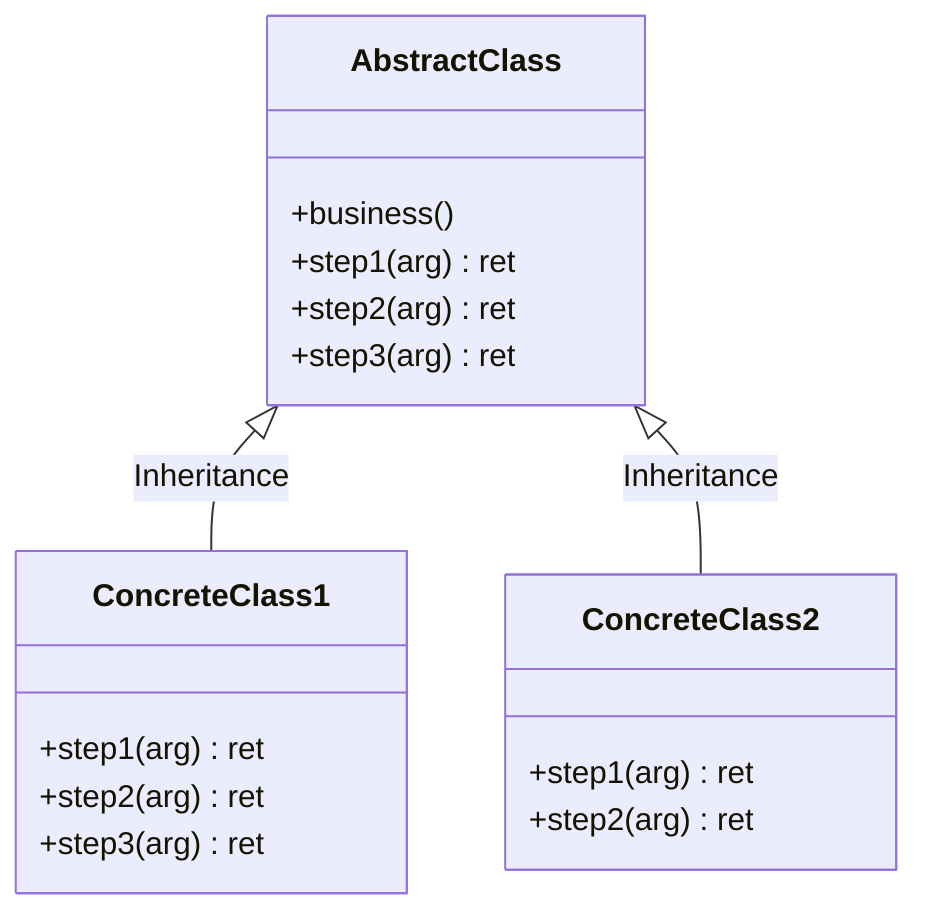
```mermaid
classDiagram
class AbstractClass
AbstractClass : +business() 
AbstractClass : +step1(arg) ret
AbstractClass : +step2(arg) ret
AbstractClass : +step3(arg) ret

class ConcreteClass1
ConcreteClass1 : +step1(arg) ret
ConcreteClass1 : +step2(arg) ret
ConcreteClass1 : +step3(arg) ret

class ConcreteClass2
ConcreteClass2 : +step1(arg) ret
ConcreteClass2 : +step2(arg) ret

AbstractClass <|-- ConcreteClass1 :Inheritance
AbstractClass <|-- ConcreteClass2 :Inheritance


```


<br>

其中角色分为以下两部分：

1. 超类，类中已经给出了业务逻辑的基本骨架，并且提供了几个钩子方法供子类实现
2. 具体实现子类，补充实现抽象类中的钩子方法或者抽象方法，对整个算法框架做一个补充扩展。

调用者直接调用不同的实现子类，就可以使用不同算法。

<br>

使用示例如下：

- JDK 的 HashMap 和 LinkedHashMap 

LinkedHashMap 继承了 HashMap，并且实现了 afterNodeAccess 和 afterNodeInsertion 等钩子方法，在原增删方法的逻辑后面增加了链表的相关操作。

- Netty 的 EventLoopGroup 相关类

Netty 中的 EventLoopGroup 相当于是一个 EventLoop 的集合，但 EventLoop 的实现确实不同的，比如 NioEventLoop，EpollEventLoop 等。

所以 EventLoopGroup 将创建不同的 EventLoop 的逻辑抽象成了一个 newChild 方法，在 NioEventLoopGroup 中创建的就是 NioEventLoop。

- 个人使用经历

该模式我在具体的生产代码中用来改写过一个合同模块，就是一个添加参数调用三方合同接口的功能。

其中不同的场景就有不同的参数，都是从  UserInfo  中抽取的一个 Map 对象，并且三方的调用接口逻辑相同。

所以就可以使用模板方法模式，将接口调用逻辑作为公共算法骨架，而参数获取的流程作为抽象方法。

刚开始感觉实现还不错，但到后来因为合同的越来越多，缺点也就显示出来了，不同的实现对应不同的子类，导致我一个合同实现子类就有接近20个类。

> 模板方法模式算是比较实用的模式了，在一些框架的源码中往往会先创建一个顶级的接口对象，然后创建 Abstratc 类实现部分通用逻辑。

<br>

**直观上感觉，模板方法模式抽象出来的超类可以减少大量的代码重用，并且提供的钩子或者说模板方法，使扩展也变得更加容易。**

另外就是 Hash 和 EventLoopGroup 实现中的一点不同，HashMap 并不依赖模板方法执行，即使不实现模板方法，HashMap 也能使用，但是 EventLoopGroup 对于 newChild 却是强依赖关系的。

<br>

>  模板方法模式的优点：

1. 减少代码重复（相同的逻辑可以在算法模板中实现
2. 易于扩展（通过继承并实现钩子方法的形式，可以很方便的对原实现类作扩展

<br>


### 策略模式(Strategy)

策略模式的定义如下:

> **Define a family of algorithms, encapsulate each one, and make them interchangeable.**

**策略模式是将一个完整的业务逻辑中的部分算法抽象为接口，并通过继承来实现不同功能的子类，使不同子类相互替换，也就可以在不改变当前实现的情况下改变类的行为。**

类图如下：


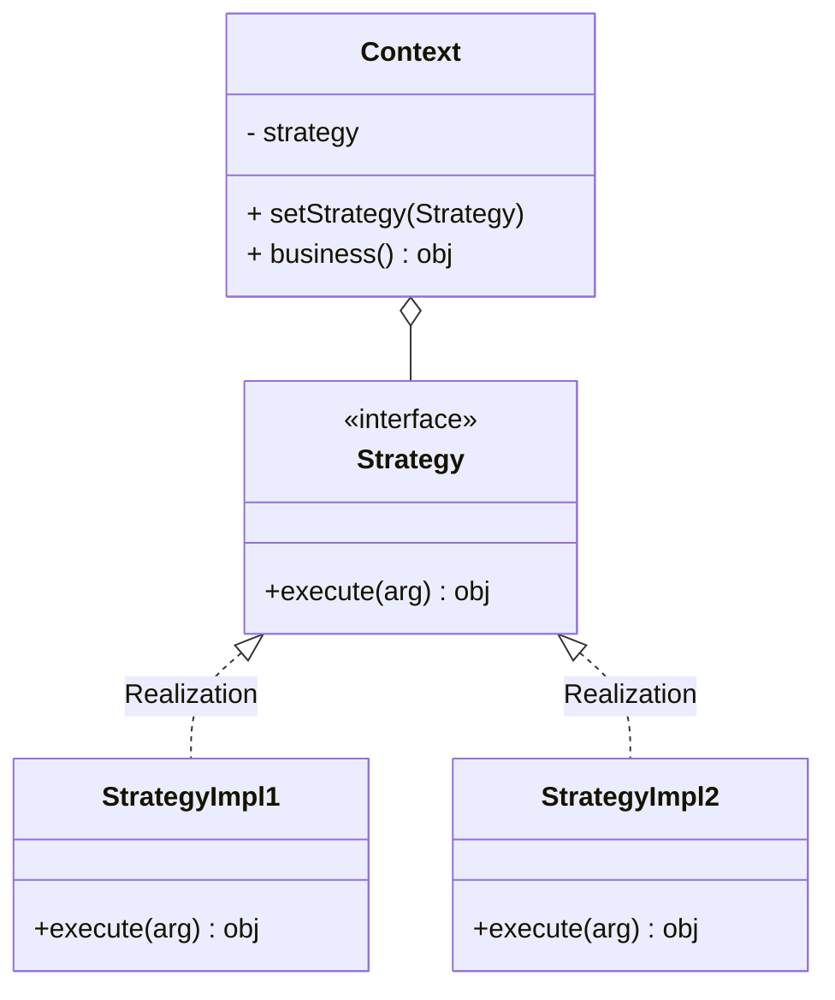
```mermaid
classDiagram
class Context
Context: - strategy
Context: + setStrategy(Strategy)
Context: + business() obj

class Strategy
<<interface>> Strategy
Strategy: +execute(arg) obj
Context o--	Strategy

class StrategyImpl1
StrategyImpl1: +execute(arg) obj

class StrategyImpl2
StrategyImpl2: +execute(arg) obj

Strategy <|.. StrategyImpl1 :Realization
Strategy <|.. StrategyImpl2 :Realization


```

<br>

基本角色如下：

1. Context，环境上下文类，简单来说就是执行具体的算法逻辑的地方
2. Strategy，算法的抽象接口，在定义接口的时候算法相关的入参和出参基本就是确定的
3. Concrete Strategy，真实的算法实现类，可以有多种不同的实现

<br>

策略模式的使用实例如下：

- JDK 的 ThreadPoolExecutor 

ThreadPoolExecutor 中对于等待队列（BlockingQueue）以及拒绝策略（RejectedExecutionHandler）等相关组件实现都是通过策略模式实现的，不同的等待队列，不同的拒绝策略就会使 ThreadPoolExecutor 有不同的逻辑表现。

以 ThreadLocalExecutor 为例，整个 ThreadLocalPool 就是上下文类，它包含了完整的业务逻辑，RejectedExecutionHandler 就是算法的接口类，它抽象出了拒绝溢出任务的这部分逻辑，供子类实现。

- Ribbon 的 负载均衡策略

抽象了 ILoadBalancer 作为顶级的算法接口，声明了包含添加和选择在内的一系列方法签名。

- Netty  ChannelHandler 实现

Netty 中定义了 ChannelOutboundHandler 和 ChannelInboundHandler 两种顶级接口，分别代表了出站和入站消息的处理逻辑。

ChannelPipeline 中就是对各种 ChannelHandler 的排列组合，以此完成不同的业务逻辑。

<br>

<br>

另外，在 Java 中策略模式可以使用枚举类来完成，示例代码如下：

```java
public enum Strategy {
    ADD {
        @Override
        public int calculate(int a, int b) {
            return a + b;
        }
    },
    REDUCE {
        @Override
        public int calculate(int a, int b) {
            return a - b;
        }
    };

    public abstract int calculate(int a, int b);
}
```

<br>

策略模式降低了具体算法和上下文之间的耦合性，完美的符合开闭原则。

<br>

### 策略模式和方法模式的比较

策略模式和模板方法模式都是对一个完整的业务逻辑中，某段算法逻辑的抽象表示。

但**模板方法模式的实现是通过继承**，抽象的方法并没有独立为一个接口，而是在环境类内部作为一个抽象方法，而**策略模式将该段算法逻辑独立为一个接口，然后以组合的使用使用该算法**，更好的降低了环境和算法实现之间的耦合性。

策略模式的实现上可能会表现的更加独立，例如对于 ThreadPoolExecutor 中的阻塞队列（BlockingQueue）的实现，而模板方法模式可能还需要依赖环境上下文来执行，例如 LinkedHashMap 的实现。

并且 LinkedHashMap 是一个相对固定的实现，并没有过多的策略选择。

<br>

### 命令模式(Command)

命令模式的定义如下：

> **Encapsulate a request as an object, thereby letting you parameterize clients with different request, queue or log request, ans support undoable operations.**

类图如下：

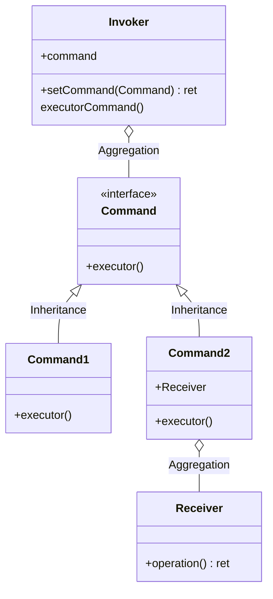
```mermaid
classDiagram

class Invoker
Invoker: +command
Invoker: +setCommand(Command) ret
Invoker: executorCommand()

class Command
<<interface>> Command
Command: +executor()

class Command1
Command1: +executor()

class Command2
Command2: +Receiver
Command2: +executor()

class Receiver
Receiver: +operation() ret

Command <|-- Command1 : Inheritance
Command <|-- Command2 : Inheritance
Invoker o-- Command : Aggregation
Command2 o-- Receiver : Aggregation


```

<br>

**命令模式算是对调用行为的一种封装，使用命令的形式封装各类实际的调用逻辑，实现调用者和实现者之间的类间解耦。**

角色如下：

- Command - 命令接口

该接口定义了命令族的方法签名以及返回值。

- Receiver - 业务逻辑的具体实现，

可有可无，并不是所有的命令都需要持有一个 Receive 的引用。

- ConcreteCommand - 具体的命令实现

调用者直接以对 ConcreteCommand 的调用来实现自己想要的功能。

- Invoker - 具体的调用者

有些例子里面调用者之间和 Command 之间还有一层 Invoker 的调用，个人感觉是多余的。

<br>

命令模式的缺点就是每个逻辑都需要实现 Command，会导致实现类的快速的膨胀，并且因为统一的接口导致了入参也受到了一部分限制。

<br>

使用实例：

- Hystrix 中的各类业务执行就是封装在 HystrixCommand 类中实现的。

<br>

以 HTTP 调用的业务场景为例子:

```java
// 相当于 Command 的接口，声明了统一的方法签名，也定义了入参和返回值
ublic interface HttpCommand {
	/**
	 * 执行命令
	 *
	 * @param request 请求
	 * @return 响应
	 */
	Response executor(Request request);
}

// 封装的对 Get 请求的调用命令
// 使用 HttpClient 实现
public class GetCommand implements HttpCommand {

	// HttpClient 

	@Override
	public Response executor(Request request) {
		return null;
	}
}

// 封装的对 Post 请求的调用命令
// 使用 OkHttp 实现
public class PostCommand implements HttpCommand {

	// OkHttp

	@Override
	public Response executor(Request request) {
		return null;
	}
}

// 真实调用者
public class Invoker {

	public static void main(String[] args) {
		// 真实调用就不需要直到 Get 或者 Post 的实现，直接使用命令类就好
		HttpCommand command = new GetCommand();
		final Response response = command.executor(new Request() {
		});
	}
}

```

以上的例子及其简单。，

<br>

和其他设计模式的配合:

- 单例模式

如果实现的命令类是无状态的，类似以上的 HTTP 请求，就可以直接以单例模式来实现命令，在 JAVA 中可以进一步使用枚举来实现。(个人非常喜欢这么写，很优雅很高级，hahah

```java
public enum HttpCommandEnum {
	/**
	 * get 请求
	 */
	GET(new HttpCommand() {
		@Override
		public Response executor(Request request) {
			return null;
		}
	}),
	/**
	 * post 请求
	 */
	POST(new HttpCommand() {
		@Override
		public Response executor(Request request) {
			return null;
		}
	});
	private HttpCommand command;
	HttpCommandEnum(HttpCommand command) {
		this.command = command;
	}
}
```

<br>

<br>

### 责任链模式(Chain Of Responsibility)

责任链模式的定义如下:

> **Avoid coupling the sender of a request to its receiver by giving more than one object a chance to handle the request. Chain the receiving objects and pass the request along the chain until an object handles us.**

类图如下:

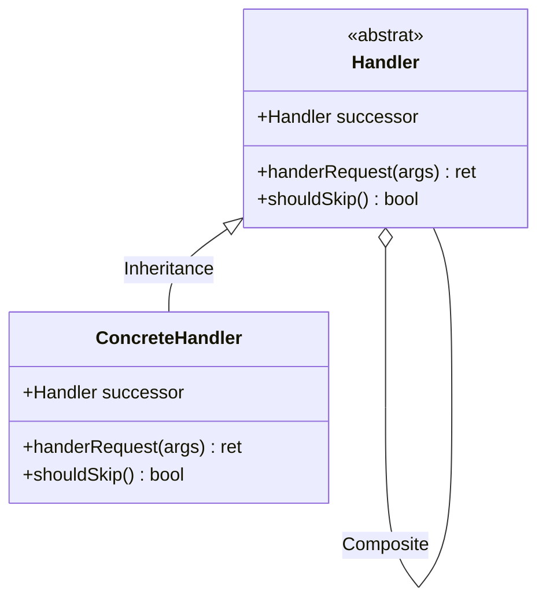
```mermaid
classDiagram

class Handler
<<abstrat>> Handler
Handler: +Handler successor
Handler: +handerRequest(args) ret
Handler: +shouldSkip() bool

class ConcreteHandler
ConcreteHandler: +Handler successor
ConcreteHandler: +handerRequest(args) ret
ConcreteHandler: +shouldSkip() bool

Handler <|-- ConcreteHandler :Inheritance
Handler o-- Handler :Composite
```

<br>

责任链模式是我个人非常喜欢用的一种设计模式。

责任链默认的主旨就是将处理方法方法拼接成一条链子，近乎完全的解耦了调用者和被调用者之间的耦合关系，调用者只需要调用链的开头就好，而非熟悉全部的调用关系。

<br>

比如我们公司的申请，请假申请小于三天就需要我组长审核，大于三天需要到人事和总经理审核，其他申请还有各自需要通报的人员，此时可以将人员组成一条责任链，我每次只需要提交给组长，组长审核完之后提交到下一个就好，不需要我到处跑。

<br>

和别的设计模式的组合:

- 组合模式 + 单例

这是我个人常用的组合，Chain 对象和具体的处理器继承同一个接口，Chain 对象中额外实现 Chain 对象的收集，可以使用一个 List 保存，然后提供一个单例

<br>

使用实例:

- Netty 中的 ChannelPipeline 

Netty 中的责任链优化的更多，ChannelHandler 只负责业务处理并不会带有组链的功能，组链的功能是由 ChannelHandlerContext 提供的，ChannelContext 中的链并不是单向而是双向链，并且每个处理器都有多个方法。


个人使用例子:

- 合同签署模块

- RPC 的服务注册和发现模块

个人实现的 RPC 计划可以向多个注册中心注册服务，所以此时就将所有已实现的注册逻辑组成一个链，单类的注册中心甚至可以有多个处理器，根据是否有相关的配置以及配置的正确性判断是否需要注册。

服务启动时，只需要将服务名称传递给链首元素，就可以完成 RPC 服务的多节点注册。

<br>

责任链模式的优点在于完全的解耦，调用者只需要将请求扔到链中传递，而无需知道具体的调用对象和逻辑。

缺点在于如果责任链过长，会导致性能有所下降。


### 状态模式（State）

状态模式定义如下:

> **Allow an object to alter its behavior when its internal state changes. The object will appear to change its class.**

状态模式的类图如下：

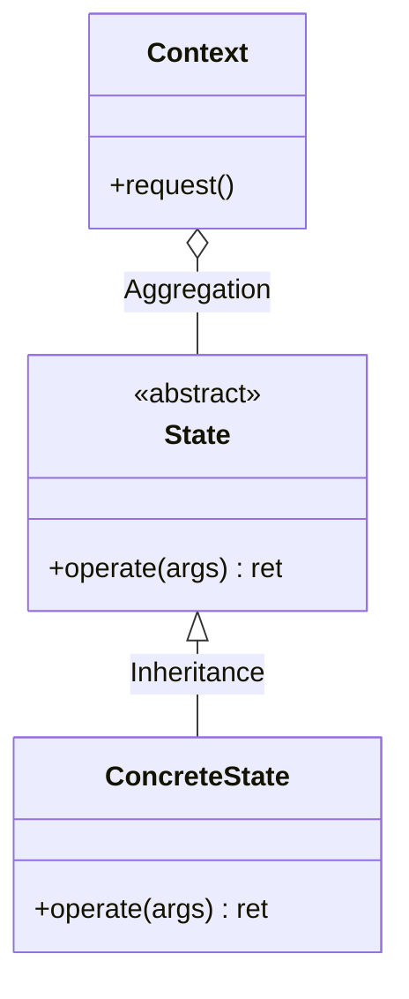
```mermaid
classDiagram
 
class State
<<abstract>> State
State: +operate(args) ret

class Context
Context: +request()

Context o-- State : Aggregation

class ConcreteState
ConcreteState: +operate(args) ret

State <|-- ConcreteState : Inheritance


 
```

状态模式多少和有限状态机的概念有些关系。

有限状态机表示的是一个系统内的行为和其状态的相关性，一种状态会向特定的几种状态转移，并且转移之后系统的行为也跟着发生变化。

<br>


### 观察者模式(Observer)

观察者模式的定义如下:

> **Define a one-to-many dependency between objects so that when one object changes state, all its dependents are notified and updated automatically.**

观察者模式基本实现的**要点就是被观察者持有观察者的引用（一对多的关系）**，特定时机由观察者调用被观察者相关方法，传入对应参数。

借助观察者模式，可以很好的在方法执行周期中做扩展。

<br>

观察者模式的进一步实现包括监听器模式（例如，Guava  的 EventBus 的实现。

EventBus 的实现相对于观察者模式有以下几种有点：

1. 观察者和被观察者接耦。（监听器由三方对象持有
2. 对观察的参数的抽象。（所有的监听器都会创建一个 Event 类，表示触发的事件，包含了希望的参数


Fallback 实现也是观察者模式的一种。

<br>

使用实例：

1. EventBus
2. Spring 中大量运用了观察者模式，例如 BeanPostProcessor，各类 Listener，XXXAware（ApplicationContextAware 等。

<br>

<br>

### 中介者模式(Mediator)

中介者模式的定义如下：

> **Define an object that encapsulates how a set of objects interact. Mediator promotes loose coupling by keeping objects from referring to each other explicitly, and it lets you vary their interaction independently.**

类图如下：

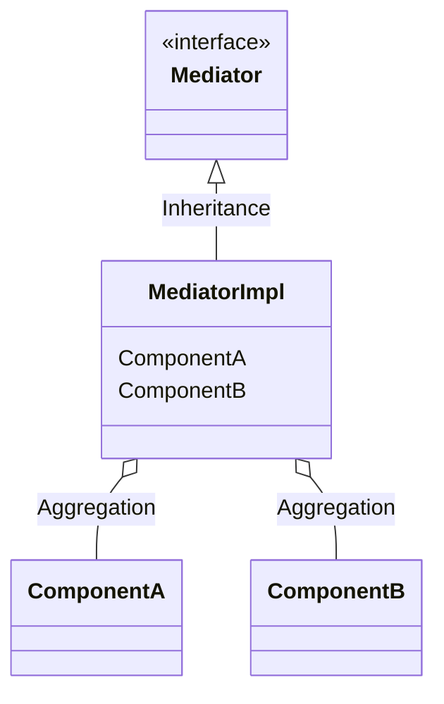
```mermaid
classDiagram

class Mediator
<<interface>> Mediator

class ComponentA

class ComponentB

class MediatorImpl
MediatorImpl: ComponentA
MediatorImpl: ComponentB

Mediator <|-- MediatorImpl : Inheritance
MediatorImpl o-- ComponentA : Aggregation
MediatorImpl o-- ComponentB : Aggregation


```

**中介者模式的关键是使用一个 Mediator 类来封装多个组件之间的相互调用关系，客户端直接调用 Mediator 来间接完成对多个组件的调用。**

<br>

中介者模式**主要是对是对迪米特法则的实现**，调用者和组件之间的依赖关系被转接到 Mediator 类上，**该类包含了类之间的调用关系。**

从另外一方面来说，可以看作是**中介者模式组合了各个组件来实现一个相对复杂的逻辑，**类比现实的话，产品经理其实就是一个中介者，接收不同甲方的需求，分派给前端，后端，UI 等人员，并负责进度把控。

但是过多组件同样会使 Mediator 的实现不断膨胀，而且逻辑也会越来越复杂，有点违反单一职责原则，所以实现的时候需要注意中介者类管理的组件个数。

<br>

类之间的相互调用的依赖也存在一定的合理性，并不是所有的组合都需要使用中介者模式。

<br>

<br>

### 中介者模式和门面模式的对比

<br>

门面模式抽象出高层接口，并使用组合来完成对子系统调用的简化，**注意只是简化，门面模式能完成的任务在子系统中也可以完成，所有门面模式中不会也不该出现业务逻辑。**

但是中介者模式就是为了对调用者屏蔽类与类之间的调用关系而存在的，它的实现类中就包含了类之间的调用顺序，相比于门面模式它有更高的封装度，有自己业务逻辑。

**通过组合各个组件，中介者模式的实现类可以对外提供单个子系统无法提供的功能。**

<br>

<br>

### 命令模式和中介者模式的对比

命令模式

<br>

<br>

以下四个是我个人认为没那么重要的模式，实现起来可能不复杂但是场景限制太多。

<br>

### ~~迭代器模式(Iterator)~~

迭代器模式的定义如下:

> Provide a way to access the elements of an aggregate object sequentially without exposing its underlying representation.

迭代器模式基本上已经没人使用的。

如定义中所讲，迭代器模式主要是提供一种方法访问集合中的每个元素，并且不暴露集合的内部实现，也可以说是屏蔽内部实现。

比如一个 List，不论是 LinkedList 还是 ArrayList，都可以返回一个 Iterator 对象，实现无差别访问。

### 访问者模式(Visitor)

访问者模式的定义如下:

> **Represent operation to be performed on the elements of an object structure. Visitor lets you define a new operation without changing the classes of the elements on which it operates.**

### 备忘录模式(Memeto)

备忘录模式的定义如下:

> Without violating encapsulation, capture and externalize an object's internal state so that the object can be restored to this state later.

备忘录模式提供了一种程序数据的备份方法，是对象的备份模式。

### ~~解释器模式(Interpreter)~~