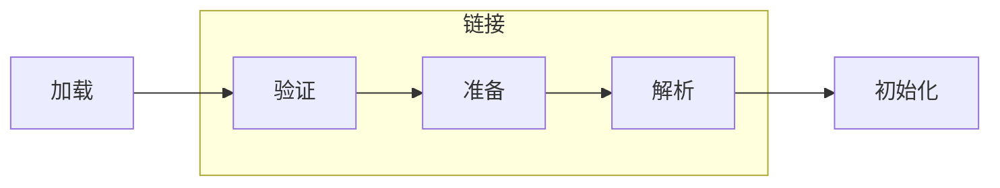
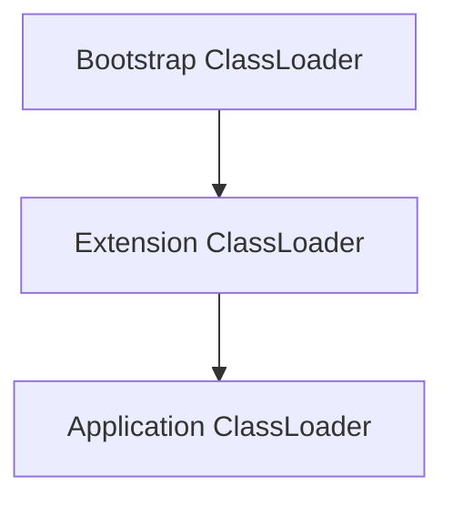
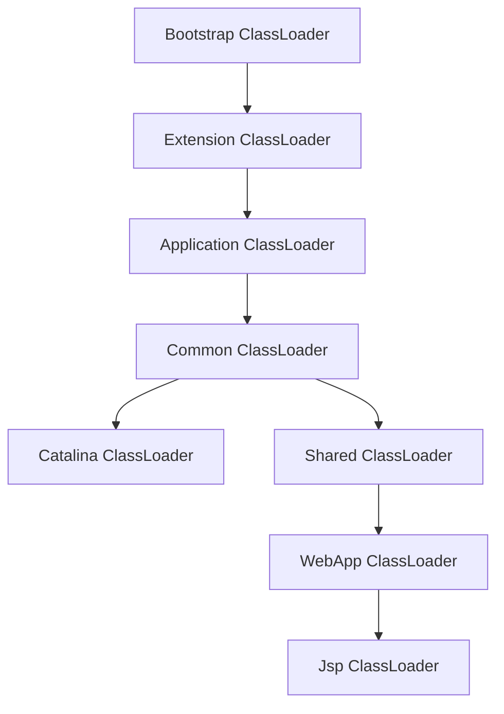

# 类加载子系统


## 思维导图


<br>

<br>

## 概述

Java 的类加载子系统负责从网络或者本地文件等多途径获取以 .class 结尾的字节码文件，并解析成基本的 Class 类型。

加载子系统只负责类的加载，保证类的安全性，执行还是交给执行子系统的。

<br>

<br>


## 类加载的流程




**实际的类加载流程是交叉进行的，并不是线程执行，**例如加载到二进制流之后，验证就会开始文件结构验证。

<br>

- 加载

加载就是通过**类的全限定名**获取该类的字节码文件的二进制流，并将其转化为运行时的数据结构，也就是 Class 文件。

<br>

- 验证

验证是指对二进制流的验证，验证是否满足 JVM 的规范，是否会威胁到 JVM 自身的运行。

验证细分有以下四个部分：**文件结构验证，元数据验证，字节码验证，符号引用验证**。

在文件结构验证时候，二进制流就转化为了运行时数据结构，以后的验证都是对运行时结构的验证。

符号引用验证会在解析的时候执行。

<br>

- 准备

准备过程是给类变量分配空间的过程，并且回给类变量赋系统初值。

系统初值是指 JVM 默认的值，例如 boolean 类型默认会为 false 等。

<br>

- 解析

解析是对符号引用的解析，确保符号引用是全部有效，并将其转化为直接引用。

Class 文件常量池中就包含了一部分的符号引用。

<br>

- 初始化

初始化是执行 `<cinit>` 的过程。

`<cinit>`  就是从类文件中收集的包括静态初始化快，字面量初始化等等的语句。

> 有一个注意点是静态初始化块是从上到下顺序加载并执行的，并且先于构造函数的 <init> 执行。

<br>

<br>

### Class 加载和卸载

- 加载的时机

1. 创建类实例对象的时候，通过 new，reflect 等途径 
2. 调用类的静态方法或者访问类的静态变量的时候
3. 初始化子类时发现父类未加载，会先加载父类

> 不全，代补充。

<br>

- 卸载的时机

1. 该类所有的实例都已被回收
2. 该类的 ClassLoader 已经被回收
3. 该类的 Class 对象没有在任何地方被引用

<br>

### Class 对象的存放

类加载器加载 Class 文件，输出一个 Class 类，该类的信息都保存在**元空间**（1.8及以上版本），元空间是一片直接内存，会以 ClassLoader 为单位划分区域，每个 ClassLoader 还会保存各自加载过的类。

装载过程中，字面量，常量会加入到各自的运行时常量池，部分符号引用此时会被解析为直接引用，另外还会保存一份虚方法表。

<br>

<br>

## 基本的类加载器




以上是 JDK 中提供的三种基础的类加载器。

- Bootstrap ClassLoader 

该类加载器使用 C 语言实现，直接内置在 JVM，用于加载 Java 核心库，例如 rt.jar 或者 bootstrap 目录下的依赖。

并且出于安全考虑，该加载器只会加载 java，javax，sun 开头的类。

<br>

- Extension ClassLoader

扩展的类加载器，使用 Java 语言编写，具体实现为 sun.misc.Launcher$ExtClassLoader。

用于加载 /jre/lib/ext 下的类库，以 Bootstrap ClassLoader 为其父类

<br>

- Application ClassLoader

应用类加载器，具体实现为 sun.misc.Launcher$AppClassLoader。

用于加载 CLASSPATH 目录下的类，为 ExtClassLoader 的子类。

<br>

> Bootstrap 和 Extension 两个加载器扫描的类的目录已经被限定死了，这是后续 SPI 等实现必须要通过 TCCL 的原因之一。

<br>

> 还有一点重要的，Java 中判断两个 Class 是否相等，除了其本身还需要判断对应的类加载器是否一致，同个 Class 文件被不同的 ClassLoader 装载就是不同的 Class 对象。

<br>

## ClassLoader 的基础实现

ExtClassLoader 和 AppClassLoader 都定义在 sun.misc.Launcher 中的，Launcher 是 Java 程序启动的起点。

<br>

### Launcher 的初始化

介绍 ExtClassLoader 和 AppClassLoader 两种基本类加载器的创建过程。

> Bootstrap 是内置在 JVM 中的，Java 程序启动的时候就是由 Bootstrap 先加载 Launcher 对象。

<br>


上图， Launcher 的构造函数中主要就包含了以下三个逻辑：

- 创建 ExtClassLoader
- 以 ExtClassLoader 为参数，创建 AppClassLoader
- **设置当前线程上下文加载器为 AppClassLoader**

<br>

<br>

### ClassLoader 的实现

AppClassLoader 和 ExtClassLoader 都继承于 URLClassLoader，而 URLClassLoader 又是继承与 ClassLoader 的。

ClassLoader 中分别有以下几种重点方法：

| 方法名                                  | 作用                                                         |
| --------------------------------------- | ------------------------------------------------------------ |
| loadClass(String,boolean)               | 加载指定的 Class 文件的二进制流数据，boolean 表示是否对 Class 对象进行解析 |
| findClass(String)                       | 搜索 Class 文件，入参为类的全限定名                          |
| defineClass(byte[] b, int off, int len) | 该方法用于将 byte 字节流解析成 Class 对象，入参就是 byte 数组。 |
| resolveClass(Class≺?≻ c)                | 解析并初始化 Class 类                                        |

<br>

#### #loadClass(String)

该方法是 ClassLoader 中最主要的方法，**双亲委派机制** 就是在该方法中实现的，`ClassLoader.loadClass` 也是常用的用于加载某个类的常用方法。

> 有个容易忽略的点是，该方法可以获得 Class 类，但是并不会触发 Class 类的初始化，也就是类加载的最后一步。
>
> 但 Class.forName 会触发类的初始化，

<br>

```java
// ClassLoader#loadClass
protected Class<?> loadClass(String name, boolean resolve)
    throws ClassNotFoundException
{
    synchronized (getClassLoadingLock(name)) {
        // First, check if the class has already been loaded
        // 通过缓存查找是否被该类加载器加载过。
        Class<?> c = findLoadedClass(name);
        if (c == null) {
            long t0 = System.nanoTime();
            try {
                if (parent != null) {
                    // 通过父类加载器，加载 name 类
                    c = parent.loadClass(name, false);
                } else {
                    // 直接通过 Bootstrap 加载类
                    c = findBootstrapClassOrNull(name);
                }
			...
			
            // 都找不到
            if (c == null) {
                ...
                // 调用 findClass 方法获取 Class 类
                c = findClass(name);
				...
            }
        }
        // 是否需要解析
        if (resolve) {
            // 需要就调用 resolveClass 
            resolveClass(c);
        }
        return c;
    }
}
```

从上面的代码可以大概的看出类加载的逻辑:

1. **尝试从缓存中获取 Class**
2. **通过 父类 或者 Bootstrap 获取 Class**
3. **通过 findClass 方法获取 Class**

以上三种就是 Class 对象的主要获取方式，之后根据参数会判断是否需要调用 resolveClass 方法进行解析。

最后调用的 findClass 方法在 ClassLoader 中是一个空方法，也就是模板方法，等待子类继承实现，URLClassLoader 就实现了该方法。

另外在方法的注释上也表明，**实现者推荐开发者实现 findClass 方法，而并不推荐直接重写 loadClass 方法。**

<br>

<br>

## 双亲委派机制

上文说的，ClassLoader#loadClass 方法中实现了双亲委派机制的基础逻辑。

**所有加载的类都会优先由父类加载，从下往上传递类加载任务，如果父类无法加载再由子类进行加载。**

> 实现中可以看到，即使没有父类加载器，也会先从 Bootstrap 加载目标类，这就保证了 Java 核心类库的安全。

<br>

双亲委派的优势:

1. 避免了类的重复加载，父子之间就是一条责任链，父类加载过的类不需要子类重新加载。
2. 提高了程序的安全性，类似 java.lang.String 就只能通过 Bootstrap 加载

> 代补充。

双亲委派机制的层次性是自下而上的，下级的类加载器共享上级的类加载器所加载的类，但是下级加载的类堆上级是不可见的。

<br>

<br>

## 线程上下文类加载器

在 Launcher 的构造函数中就出现了相关逻辑，**设置了 AppClassLoader 作为当前线程的上下文加载器**。

线程上下文加载器可以当做是将类加载器和线程绑定，在线程中保存一份加载器的引用，因此在任何地方都可以获取到当期线程的上下文类加载器。

```java
// 获取当前线程上下文类加载器的方法
Thread.currentThread().getContextClassLoader();
```

**该方法的出现就是为了打破双亲委派机制**。

在双亲委派机制中，类加载的任务是从下往上传递的，但是总有一些意外情况，比如 Java 核心类库中的类需要加载第三方类库的实现，比如 ServiceLoader 实现的 SPI 机制。

Java 核心类库都是通过 Bootstrap 实现的，但是因为 Bootstrap 被限定了目录以及类路径前缀，所以无法被用来加载 ServiceLoader，此时就可以通过 线程上下文类加载器 实现高层的类加载器调用底层去加载类的逻辑。

<br>

> 非常重要的一点：
>
> **类优先由触发类加载的类所属的类加载器加载。**

<br>

<br>

## 打破双亲委派机制的实例

### Tomcat 的类加载机制

Tomcat 作为一个 Web Servlet 容器，肯定需要装载多个 Web 应用，多个应用之间的依赖库不可能完全一致，可能出现同个依赖不同版本的情况，也可能出现两个应用之间类名相同的情况，这个时候就需要在多个 WebApp 之间做类上的隔离，另外同一个应用不可能说相同的依赖还需要重复加载几次，所以也存在依赖复用的情况。

另外 Tomcat 还提供了 Jsp 的热加载功能，动态的卸载和加载 Jsp 类。

> JSP 最后会被转化为 Class 然后执行输出。




所以 Tomcat 设计了如上的一套类加载体系。

除开三种基础的类加载器，Common 就是 Tomcat 中最上层的，他加载的类对所有的 Web 应用共享，并且对 Tomcat 自身也是共享的。

Catalina 负责加载的是 Tomcat 专用的一些类，比如 Tomcat 中的 Connector 等一些基础组件，这些对 Web 应用来说是不可见的，是隔离开的。

Shared 负责加载的是所有的 Web 引用共享的类，它和 Catalina 相隔离，互相不可见。

WebApp 负责加载当应用的类库，一个应用就对应这一个 WebApp 类加载器，相互之间隔离互相不影响，并且共享 Shared 类加载器加载的共用类。

Jsp 比较特别，它是每一个类一个类加载器，用于在 Jsp 文件修改之后做热更新。

> Common，Catalina 以及 Shared 都有指定的目录，不过不是本文的重点就不说了。

<br>

**通过以上的体系，Tomcat 实现了类之间隔离和共享的关系区分。**

实现上 Catalina 和 Common 以及 Shared 都是 URLClassLoader，还是遵从的双亲委派机制的。

但是 WebApp 是单独实现的，继承了 URLClassLoader，并重写了 loadClass 方法，在查找了当前的 ClassLoader 的缓存之后，并没有直接使用父类加载器加载，而是继续在本地查找，找不到再去父类查找。

<br>

### JDK 的 SPI 实现 - JDBC Driver 实现的加载

JDBC 的核心类定义在 Java 的核心库，由 Bootstrap 加载，但是三方的实现却是在 ClassPath 里，需要使用 Application 来加载。

在 Java 的核心类加载三方实现的时候默认就是从  Application 加载，此时就会出现 ClassNotFound。

<br>

**JDBC 就在采用的方法就是 TCCL (Thread Context Class Loader) 线程上下文类加载器。**

在核心类中获取当前线程中绑定的类加载器，由此优先高级别类加载器调用低级别类加载器的实现。

<br>

参考 DriverManager 获取 Driver 的实现。

首先该类的静态初始化块中就包含了 Driver 的类加载流程。


在 loadInitialDrivers 方法中调用了 ServiceLoader 的 load 方法：


而在 ServiceLoader 中就包含了对线程上下文类加载器的调用：


<br>

<br>

### Spring 的类加载机制

Spring 的类加载场景比较复杂，所以基本是统一采用 TCCL 来实现类加载，Spring 研究不多，待补充。
